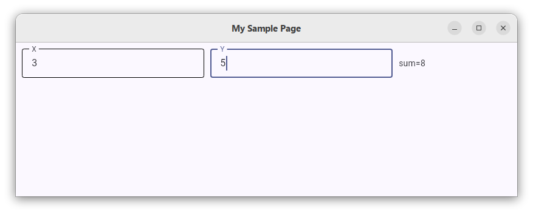

# 目录
* [概要](#概要)
* [组件描述符](#组件描述符)
* [通过描述符加载组件](#组件描述符)
* [控制器](#控制器)
 * [set_variable](#set_variable)
 * [register_input_bind](#register_input_bind)
 * [register_output_bind](#register_output_bind)
* [例子](#例子)

# 概要
Python有一个构建桌面UI程序的软件包，叫flet。
fletext是一个帮助你更容易的构建flet UI程序的软件包，它的基本思想是：
- 组建的状态被认为是商业逻辑的投射。具体说，就是，组建的属性可以绑定到控制器的变量
- 每当控制器的某些变量发生变化后，控制器可以更新某些变量的值，这个操作在`on_variable_updated`中，由控制器根据商业逻辑来实现。
- 控制器的的某些变量可以被投射到组建的属性，这样，当相关的控制器变量被改变后，组建的状态就自动被更新了。

这个思想同传统的MVC的想法其实本质上是一样的。


# 组件描述符
组件描述符是JSON格式，你可以把它存放在YAML文件中。下面是一个例子
```yaml
$type: Row
controls:
  - $type: TextField
    $refid: x
    label: Hello
  - $type: TextField
    $refid: y
    label: Hello
  - $type: Text
    $refid: sum
    value: 
  - $type: Button
    $refid: test
    content:
      $type: Text
      value: Open Dialog
```
- ❔开头的属性直，表示它是一个context变量表达式
- ❕开头的属性直，表示它是一个python变量表达式
- $type表示组件类型
- $refid表示组件的索引名称。在一个组件描述符中，所有的索引名称都是唯一的。

# 通过描述符加载组件
你需要调用函数`load_component_from_descriptor`，下面是一个例子:
```python
# 加载YAML格式的组件描述符
with open(args.filename, "rt") as f:
    descriptor = yaml.safe_load(f)

# 配置context
context = {
    "DEFAULT_BORDER": ft.Border.all(2, ft.Colors.BLUE_GREY_200),
    "SYSTEM_MENU_STYLE": ft.MenuStyle(padding=0)
}

# 加载组件，加载后得到Component，其属性.ui才是flet的组建对象。
component = load_component_from_descriptor(descriptor, context=context)
page.add(component.ui)
```

# 控制器
Controller类代表了控制器。控制器负责控制商业逻辑。下面介绍一些控制器的函数。
## set_variable
```python
# 设置一个变量，变量的名字是"sum"，变量的值被设置成0
my_controller.set_variable("sum", 0)
```
## register_input_bind
```python
# 变量同组建绑定，方向是 组建 --> 变量
# 创建一个变量，并且把这个变量同索引为"x"的组建联系在一起。当索引为"x"的组件的value属性发生变化的时候，变量"x"的值会会同它保持同步。
my_controller.register_input_bind("x")
```
## register_output_bind
```python
# 变量同组建绑定，方向是 变量 --> 组建
# 创建一个变量，并且把这个变量同索引为"sum"的组建联系在一起。当变量的值发生变化时，组建的value属性会同变量的值保持同步。
my_controller.register_output_bind("sum")
```

# 例子
这个例子是一个加法起，你可以输入x和y的值，它们必须是整数。然后你会看到x+y被显示。
文件名称: `add.py`
```python
#!/usr/bin/env python
# -*- coding: UTF-8 -*-

import yaml
import flet as ft

import argparse

from fletext import load_component_from_descriptor, Controller, HANDLER_TYPE, Component

class MyController(Controller):
    def __init__(self, page:ft.Page, component: Component):
        super().__init__(page, component)

        self.set_variable("sum", "sum=0")
        self.register_input_bind("x")       # 组建"x"的value属性会被自动复制到变量"x"
        self.register_input_bind("y")       # 组建"x"的value属性会被自动复制到变量"x"
        self.register_output_bind("sum")    # 变量"sum"的值会被自动复制到组件"sum"的value属性


    def on_variable_updated(self, variable_name:str):
        # 每次有变量发生变化，这个函数会被执行
        # 它负责保证变量之间应有的逻辑关系
        x = 0
        try:
            x = int(self.get_variable("x"))
        except ValueError:
            pass

        y = 0
        try:
            y = int(self.get_variable("y"))
        except ValueError:
            pass
        
        # 我们模拟一个加法起， sum = x + y
        self.set_variable("sum", f"sum={str(x + y)}")
    
    


def main(page: ft.Page):
    page.title = "My Sample Page"
    page.theme_mode = ft.ThemeMode.LIGHT
    page.theme = ft.Theme(color_scheme_seed=ft.Colors.INDIGO)

    # 加载组件描述符
    with open("page.yaml", "rt") as f:
        descriptor = yaml.safe_load(f)

    context = {
        "DEFAULT_BORDER": ft.Border.all(2, ft.Colors.BLUE_GREY_200),
        "SYSTEM_MENU_STYLE": ft.MenuStyle(padding=0)
    }

    component = load_component_from_descriptor(descriptor, context=context)
    my_controller = MyController(page, component) # 创建控制器
    page.add(component.ui)
    


if __name__ == '__main__':
    ft.app(target=main)
```

<br />
文件名称: `page.yaml`

```yaml
$type: Row
controls:
  - $type: TextField
    $refid: x
    label: X
  - $type: TextField
    $refid: y
    label: Y
  - $type: Text
    $refid: sum
    value: sum=0
```

如果要运行这个程序，可以参考下列步骤：
```
# 现创建python虚拟环境
python3 -m venv .venv
source .venv/bin/activate
pip install pip --upgrade
pip install pyyaml flet fletext
python add.py
```

这是这个程序运行后的屏幕:<br />
